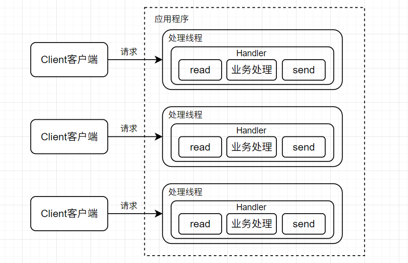
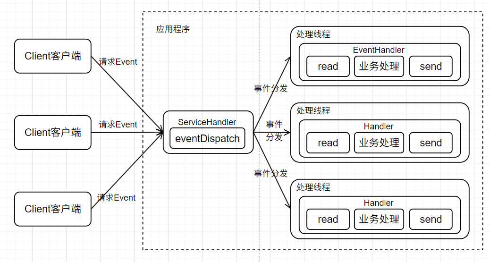

# 网络库设计-基础概念

---

### 阻塞IO-传统

传统阻塞IO服务模式特点：

1. 采用阻塞I/O模式获取输入数据
2. 每个连接都需要独立的线程完成数据的输入，业务处理，数据返回

问题分析：

1. 当并发数很大，就会创建大量线程，占用大量的系统资源
2. 连接创建后，如果当前线程暂时没有数据可读，该线程会阻塞在read操作，造成线程资源浪费、

### 异步IO-Reactor模式

Reactor模式称为**反应器模式**或**应答者模式**，是基于**事件驱动的设计模式**，其是一种用于处理并发IO/服务请求常见的网络编程中的设计模式，

核心设计思想：I/O复用（poll、epoll、select） + 线程池

当客户端请求抵达后，服务处理程序使用多路分配策略，由一个非阻塞的线程来接收所有请求，然后将请求派发到相关的工作线程并进行处理的过程。对于高并发系统经常会使用到Reactor模式，用来**替代常用的多线程处理方式**以**节省系统资源并提高系统的吞吐量**。

Reactor模型有3个重要组件，通常有**1个服务处理器**和**多个请求处理器**，

1. 多路复用器：由操作系统提供，在linux上一般是select、poll、epoll等系统调用
2. 事件分发器：将多路复用器中返回的就绪事件分到对应的处理函数中，会将**输入的请求事件**以**多路复用的方式**分发给相应的请求处理器。
3. 事件处理器：接收来自事件分发器分发的任务，负责处理特定事件的处理函数。
4. 工作模式：
    - 首先需要将所有要处理的IO事件，注册到中心IO多路复用器上，同时主线程or进程阻塞在多路复用器上，
    - 当有IO事件到来或是准备就绪时（文件描述符或socket可读可写），多路复用器返回，
    - 将事先注册的相应IO事件分发到对应的请求处理器中，进行相应的业务处理。

具体流程如下：

1. 注册读就绪事件和相应的事件处理器
2. 事件分发器等待事件。
3. 事件到来激活分发器，分发器调用事件对应的处理器。
4. 事件处理器完成实际的读操作，处理读到的数据

