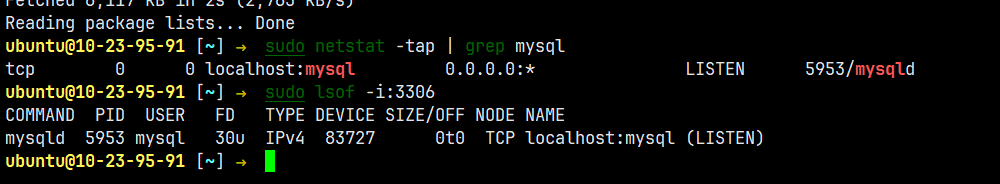
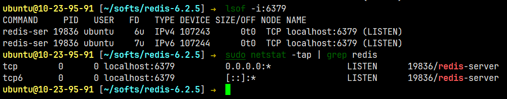

# 项目部署

---

文档地址：https://www.yuque.com/linuxer/xngi03/ol8e7u

# 项目单机部署

### 1.项目编译打包

teamtalk-server引用了很多第三方库，包括mysql、hiredis、log4cxx、protobuf等，

服务端对pb、hiredis、mysql_client、log4cxx有依赖所以需要先安装这些依赖，可以自行安装或者执行自动安装脚本，

这些脚本执行完后会自动将头文件和库文件拷贝至指定的目录，

#### mysql

1. 安装mysql服务器端与客户端

   ```shell
   sudo apt-get -y install mysql-server
   sudo apt-get -y install mysql-client
   ```

2. 安装mysql开发工具包

   ```shell
   sudo apt-get -y install libmysqlclient-dev
   ```

3. 验证是否安装成功

   ```shell
   sudo netstat -tap | grep mysql
   sudo netstat -tlnp | grep 3306
   sudo lsof -i:3306
   #查看数据库默认端口3306
   ```

   

4. 设置mysql账号密码：

   ```shell
   # 查看默认密码
   sudo cat /etc/mysql/debian.cnf
   # # ubuntu18.04则以无密码的方式登录
   mysql -uroot -p20001201
   mysql>use mysql;
   #  更新 plugin 及 authentication_string 字段，比如密码123456
   mysql> UPDATE user SET plugin="mysql_native_password", authentication_string=PASSWORD("20001201") WHERE user="root";
   #　输出以下结果
   Query OK, 1 row affected, 1 warning (0.00 sec)
   Rows matched: 1  Changed: 1  Warnings: １
   # 保存更新结果
   mysql> FLUSH PRIVILEGES;
   # 退出并重启 mysql
   mysql> exit;
   sudo service mysql restart
   ```

5. 启动/停止/重启mysql服务

   ```shell
   service mysql start 	//启动mysql
   service mysql restart 	//重新启动mysql
   service mysql stop 		//关闭mysql
   ```

#### redis/hiredis

以源码的方式进行安装，hiredis的安装在dbproxy工程中会被使用到，

1. 下载redis源码到合适的位置

   ```shell
   wget http://download.redis.io/releases/redis-6.2.5.tar.gz
   ```

2. 解压缩包并编译安装

   ```shell
   # 解压压缩包
   tar -zxvf redis-6.2.5.tar.gz
   # 编译源码
   cd redis-6.2.5
   make
   # 编译安装依赖文件
   cd deps
   make hiredis  linenoise lua jemalloc
   cd hiredis
   sudo make install
   cd ../lua
   sudo make install
   # 安装redis
   cd ../../src
   sudo make install
   ```

3. 启动Redis后台运行

   启动Redis后台运行，修改配置文件 redis.conf（在redis源码目录下）

   注意先不要设置redis授权信息auth，导致服务连不上redis

   ```shell
   # 修改配置文件
   修改 stop-writes-on-bgsave-error 设置为 no
   修改 daemonize 设置为 yes
   修改 protected-mode 设置为 no
   修改 bind 0.0.0.0
   # 运行redis后台服务
   cd /redis-6.2.5/src
   redis-server ../redis.conf
   ```

4. 验证是否安装成功

   ```shell
   sudo netstat -tap | grep redis
   sudo netstat -tlnp | grep 6379
   sudo lsof -i:6379	# 查看6379端口监听情况
   ```
   
   

#### log4cxx

make_log4cxx.sh

#### protobuf

make_protobuf.sh

所有的通讯协议文件都在pb目录下，自动化脚本编译与同步：

1. `build.sh build`：使用protoc命令将协议文件转化成对应语言的源码

2. `build.sh sync`：将生成的源码同步到目标目录下 `/src/base/pbgen` 


#### teamtalk-server

在所有的依赖以及Pb文件都编译通过后，执行脚本进行整个服务端项目的编译：

编译整个项目工程：`sudo ./build_server.sh version 1.0`，在上级目录中生成 im-server-1.0.tar.gz 压缩软件包。

### 2.安装部署运行

#### 数据库导入

```shell
sudo ./ttopen.sh install
```

#### 防火墙端口开放

| 服务            | 服务说明                                                     | 开放端口   |
| --------------- | ------------------------------------------------------------ | ---------- |
| msg_server      | 消息服务器：用户登录成功后 与指定的消息服务器进行交互        | 8000       |
| login_server    | 登录服务器：负责身份验证、并为登录成功的客户端分配 msg_server，<br/>该服务监听两个端口，tcp端口8100（与后端的服务器交互）、http端口8080（对外开放） | 8100、8080 |
| route_server    | 消息转发服务器：位于不同的消息服务器上的用户之间，交互需要通过此服务器进行消息转发 | 8200       |
| http_msg_server | 主要提供对外的Web-API服务                                    | 8400       |
| push_sever      | 消息推送服务器：针对移动端进行主动的消息推送                 | 8500       |
| file_server     | 文件中转服务器：做文件中转与临时存储                         | 8601       |
| msfs            | 文件存储服务器：小文件永久存储，包括聊天产生的图片、表情等   | 8700       |
| db_proxy_server | 数据库代理服务器：后端为存储层、代理mysql和redis对数据进行读写操作 | 10600      |
| mysql           | mysql                                                        | 3306       |
| nginx           | nginx                                                        | 81         |
| web             | teamtalk-web                                                 | 80         |

#### 部署IM服务后台

1. 解压im-server-1.0.gz软件安装包：`tar -xf im-server-1.0.tar.gz` 
2. 根据需要修改conf目录下的配置文件
3. 执行脚本进行服务器端程序的部署与启动 `sudo ./setup.sh install` 

### 3.进程管理命令汇总

```shell
# 查看正在运行的服务进程
sudo ps -ef | grep _server
# 查看端口占用情况
sudo lsof -i:8080
sudo ss -tuln | grep 8080
sudo netstat -tunlp | grep 8080
# 查看服务进程日志信息
tail -n 30 -f /home/ubuntu/teamtalk-server/im-server-1.0/login_server/log/default.log
# 重启某个服务进程

sudo ./restart.sh login_server
# 结束某个进程

# 获取某个目录读写权限
ls -ld /home/ubuntu/teamtalk-server/im_server_pack/login_server
sudo chmod 666 /home/ubuntu/teamtalk-server/im_server_pack/login_server/login_server.conf
sudo chmod -R 755 /home/ubuntu/teamtalk-server/im_server_pack
```

### 4.运行目录设计

/teamtalk/

1. @appstore：各服务二进制存放位置
2. @web：管理后台存放位置
3. @data：静态数据、配置文件

/var/teamtalk

1. log：服务运行日志
2. socket：内部socket通信地址
3. coredump：服务运行转存储文件


# 项目容器化部署

传统项目部署迁移至容器化部署，要迁移到容器化部署整体思路如下：

1. 先写Dockerfile编译/运行 IM 服务器
2. 再用docker-compose编排 MySQL/Redis/Nginx/各服务
3. 修改配置文件，IP → 容器名
4. 迁移数据（mysqldump / redis rdb）
5. 测试运行，逐步替代云主机上的老环境

### 1.拆分服务边界

即时通讯系统包含多个组件：

- mysql、redis
- login_server、msg_server、route_server、http_msg_server、push_server、file_server、msfs、db_proxy_server
- 容器化部署时需要每个服务独立容器，再通过网络互联。

常见拆分：这样方便横向扩展（例如 msg_server 可以多实例）

- **基础服务容器**：官方镜像
  - redis
  - mysql
- **应用服务容器**：
  - login_server
  - msg_server
  - route_server
  - http_msg_server
  - push_server
  - file_server
  - msfs
  - db_proxy_server

### 2.Dockerfile

为 IM 应用（C++ 程序）写一个基础 `Dockerfile`：

```dockerfile
FROM ubuntu:20.04
# 设置时区和环境
ENV DEBIAN_FRONTEND=noninteractive
# 安装编译依赖
RUN apt-get update && apt-get install -y \
    build-essential \
    cmake \
    git \
    wget \
    libmysqlclient-dev \
    libssl-dev \
    libprotobuf-dev protobuf-compiler \
    liblog4cxx-dev \
    && rm -rf /var/lib/apt/lists/*
# 拷贝源码
WORKDIR /app
COPY . /app
# 编译
RUN chmod +x build_ubuntu.sh && ./build_ubuntu.sh version 1.0
# 启动脚本
ENTRYPOINT ["./setup.sh", "install"]
```

如果不想每次容器启动都重新编译，可以先 编译出 im-server-1.0.tar.gz，再在镜像里解压运行：

```dockerfile
FROM ubuntu:20.04

WORKDIR /app
COPY im-server-1.0.tar.gz /app
RUN tar -xf im-server-1.0.tar.gz

WORKDIR /app/im-server-1.0
ENTRYPOINT ["./setup.sh", "install"]
```

### 3.Docker-compose管理依赖

编写 `docker-compose.yml`，把 MySQL、Redis、Nginx、IM 应用服务编排起来：

```dockerfile
version: "3.8"

services:
  mysql:
    image: mysql:5.7
    restart: always
    environment:
      MYSQL_ROOT_PASSWORD: "!@#123qwe"
      MYSQL_DATABASE: teamtalk
    ports:
      - "3306:3306"
    volumes:
      - ./mysql_data:/var/lib/mysql

  redis:
    image: redis:6.2
    restart: always
    ports:
      - "6379:6379"

  nginx:
    image: nginx:1.16
    volumes:
      - ./nginx/conf:/etc/nginx/conf.d
    ports:
      - "80:80"
      - "81:81"

  login_server:
    build: ./im-server
    depends_on:
      - mysql
      - redis
    ports:
      - "8080:8080"
      - "8100:8100"

  msg_server:
    build: ./im-server
    depends_on:
      - login_server
    ports:
      - "8000:8000"

  route_server:
    build: ./im-server
    ports:
      - "8200:8200"

  http_msg_server:
    build: ./im-server
    ports:
      - "8400:8400"

  push_server:
    build: ./im-server
    ports:
      - "8500:8500"

  file_server:
    build: ./im-server
    ports:
      - "8601:8601"

  msfs:
    build: ./im-server
    ports:
      - "8700:8700"

  db_proxy_server:
    build: ./im-server
    depends_on:
      - mysql
      - redis
    ports:
      - "10600:10600"
```


### 4.云主机数据迁移

mysql数据迁移：

```
mysqldump -uroot -p teamtalk > teamtalk.sql
docker cp teamtalk.sql mysql:/tmp/
docker exec -it mysql bash -c "mysql -uroot -p'!@#123qwe' teamtalk < /tmp/teamtalk.sql"
```

Redis数据迁移

1. 备份 `/var/lib/redis/dump.rdb` 文件
2. 放到容器 `./data/redis/` 目录，再映射进 Redis 容器

### 5.调整配置文件

在 `conf` 目录下修改服务的 IP：

1. 原来写死 `127.0.0.1` 的地方改成 **容器服务名**（例如 `mysql`, `redis`, `route_server`）
2. 因为 `docker-compose` 会自动给容器分配 DNS 名称

例如：db_proxy_server.conf

```
[mysql]
host=mysql
port=3306
user=root
password=!@#123qwe
```

# 集群扩展Kubernetes/k8s

适用于多实例扩展、弹性伸缩。用Kubernetes/k8s进一步扩展，方便横向扩展 `msg_server` 


# 持续集成交付cicd


