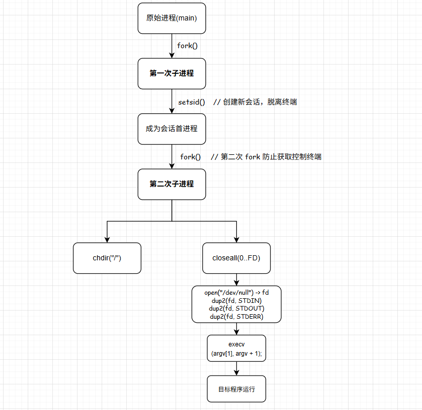

# 守护进程实现

---

守护进程实现方式常见的就是脚本实现 和 C语言实现（两次 fork + setsid），两种实现方式各有优势：

### 1.守护进程特点

Unix/Linux 守护进程的核心知识点，

守护进程（daemon）是长期在后台运行的服务进程，它与普通进程相比有一些必须具备的特点。

1. 没有控制终端：
   - **普通进程**：通常由终端启动，受终端信号控制（Ctrl+C、Ctrl+Z）
   - **守护进程**：脱离终端，不能被用户直接中断。让守护进程独立于用户环境，长期运行。
2. 运行在后台：
   - 不依赖 shell 或前台界面，用户可以关闭终端，进程仍然在运行。
3. 不依赖启动目录：
   - 守护进程通常切换工作目录到根目录 `/`，
   - 避免占用可卸载挂载点，防止当前目录被删除时出错
4. 关闭标准输入/输出/错误：
   - 守护进程不会和终端交互，所以需要关闭 stdin/stdout/stderr
5. 孤立进程组/会话：
   - 守护进程通常成为会话首进程：
   - 让它不属于任何终端的进程组，这样可以避免接收来自终端的信号干扰。
6. 权限可控：
   - 守护进程可能以 root 或普通用户运行
   - 有些守护进程先用 root 启动，然后降权限到特定用户，增强安全性
7. 不会产生僵尸进程：
   - 守护进程可能会 fork 子进程做任务
   - 通常忽略 `SIGCHLD` 或调用 `wait()` 回收子进程

| 特点               | 普通进程 | 守护进程        |
| ------------------ | -------- | --------------- |
| 是否有控制终端     | 有       | 没有            |
| 是否在后台运行     | 可选     | 是              |
| 是否依赖启动目录   | 是       | 否              |
| 标准输入/输出/错误 | 默认打开 | 关闭/重定向     |
| 是否属于会话首进程 | 通常是   | 是              |
| 是否可降权限       | 可选     | 常用            |
| 是否处理子进程僵尸 | 可能需要 | 通常忽略SIGCHLD |
| 运行周期           | 临时     | 长期            |

### 2.C语言实现



1. 第1次fork：
   - 让子进程成为孤儿进程，保证子进程不是会话首进程，然后由 `init`（或 `systemd`）收养
   - 这样子进程就不再受启动它的 shell/终端 控制
   - 父进程退出用户感觉程序结束，但实际上子进程继续在后台运行
2. setsid：
   - 创建新的会话session和进程组，让当前进程成为会话首进程
   - 脱离原来的控制终端tty，避免进程再受到终端信号（比如 `Ctrl+C`、`SIGHUP`）
   - **注意**：`setsid()` 只能在**当前进程不是进程组长**时成功，所以需要搭配第一次fork使用
3. 第2次fork：
   - 防止进程重新获取控制终端
   - `setsid()` 的结果是当前进程为 会话首进程，而会话首进程 有可能重新打开一个终端，再次变成有控制终端的进程。
   - 为了避免这种风险，第二次 `fork()`，让孙子进程 **不再是会话首进程**。这样就**绝对不能再获得终端**。
4. 关闭文件描述符、重定向日志：完整的后台守护进程。

<mark>最终目的</mark>：让指定程序再后台独立运行、彻底脱离终端、并且不产生僵尸或干扰用户的终端环境。

#### daeml

```cpp
#include <stdio.h>
#include <fcntl.h>
#include <errno.h>
#include <stdlib.h>
#include <unistd.h>
#include <signal.h>
#include <sys/wait.h>
#include <sys/types.h>

// 守护进程启动器(通用) - 将指定的程序以后台守护进程的方式启动

/* Close all file descriptors >= fd */
static void close_all_fds(int fd)
{
    int fd_limit = sysconf(_SC_OPEN_MAX);
    if (fd_limit > 128)
        fd_limit = 128;
    while (fd < fd_limit)
        close(fd++);
}

/**
 * @brief Create a daemon process
 * 
 * @param nochdir  1 = do not change working directory to "/"
 * @param noclose  1 = do not close stdin/stdout/stderr
 * @param asroot   1 = keep root privileges, 0 = drop to UID 1
 * @return int     0 = success, -1 = failure
 */
static int create_daemon(int nochdir, int noclose, int asroot)
{
    // fork
    pid_t pid;
    pid = fork();
    if (pid < 0)
        return -1;
    if (pid > 0)
        _exit(EXIT_SUCCESS); // 父进程退出

    // 创建新会话
    if (setsid() < 0)
        return -1;
    
    // 可选降权限
    if (!asroot && setuid(1) < 0)
        return -1;

    // fork
    pid = fork();
    if (pid < 0)
        return -1;
    if (pid > 0)
        _exit(EXIT_SUCCESS);

    // 切换目录
    if (!nochdir)
        chdir("/");
    
    // 关闭并重定向标准文件描述符
    if (!noclose) {
        close_all_fds(0);
        int fd = open("/dev/null", O_RDWR, 0);
        if (fd < 0) {
            fprintf(stderr, "Failed to open /dev/null, errno=%d\n", errno);
            return -1;
        }
        dup2(fd, STDIN_FILENO);
        dup2(fd, STDOUT_FILENO);
        dup2(fd, STDERR_FILENO);
        if (fd > STDERR_FILENO)
            close(fd);
    }
    return 0;
}

static void PrintUsage(const char* prog_name)
{
    fprintf(stdout,
        "\n-----\n\n"
        "Usage:\n"
        "    %s program_name [args...]\n\n"
        "Where:\n"
        "    %s - This daemon loader program.\n"
        "    program_name - Program (with path) to run as daemon.\n\n"
        "Example:\n"
        "    %s ./myprog - Run 'myprog' as daemon.\n\n",
        prog_name, prog_name, prog_name
    );
}

// ./daemon_loader <program_path> [program_args...]
int main(int argc, char* argv[])
{
    if (argc < 2) {
        fprintf(stderr, "Error: Missing program name to run as daemon!\n");
        PrintUsage(argv[0]);
        exit(EXIT_FAILURE);
    }

    const char* loader_name = argv[0];  // 守护进程加载器
    const char* target_path = argv[1];  // 要启动的目标程序路径
    char **target_argv = argv + 1;      // 要传给目标程序的参数列表

    fprintf(stdout, "Daemon loader: Launching '%s' as daemon...\n", target_path);
    
    if (create_daemon(0, 0, 1) < 0) {
        fprintf(stderr, "Error: Failed to create daemon process.\n");
        return EXIT_FAILURE;
    }
    
    signal(SIGCHLD, SIG_IGN);// 忽略子进程终止信号，避免僵尸进程
    
    execv(target_path, target_argv);// 目标程序 替换当前进程镜像
    //execl(argv[1], argv[1], NULL);

    // execv 失败
    fprintf(stderr, "Error: Failed to execute '%s', errno=%d\n", target_path, errno);
    
    return EXIT_FAILURE;
}
```


#### monitor.sh

```shell
#!/bin/sh

#############################################################
# Server Process Monitor Script
# Automatically restart servers if they are not running
# Usage: ./monitor.sh [server_type] [port]
############################################################# 

# 服务器进程监控脚本 用于监控和自动重启服务 主要功能如下：
# 1.监控服务状态：定期检查指定服务是否在运行
# 2.自动重启：如果发现服务停止，自动重新启动
# 3.日志记录：记录服务重启的时间和原因
# 4.告警通知：通过短信发送服务异常通知

# Configuration
MONITOR_INTERVAL=15
RESTART_LOG="restart.log"
PID_FILE="monitor.pid"
OLD_LOG_DIR="oldlog"

# SMS notification function (to be implemented)
send_sms() {
    echo "SMS Alert: Server $1 is not running" >&2
    # Add actual SMS sending logic here
    # Example: curl to SMS API
}

# Log function
log_message() {
    echo "$(date '+%Y-%m-%d %H:%M:%S') - $1" >> "$RESTART_LOG"
}

# Check required directories
setup_environment() {
    if [ ! -d "$OLD_LOG_DIR" ]; then
        mkdir -p "$OLD_LOG_DIR"
    fi
}

# Monitor function for standard servers
monitor_server() {
    local server_name="$1"
    
    if [ ! -e *.conf ]; then 
        echo "Error: No config file found"
        return 1
    fi
    
    echo $$ > monitor.pid
    setup_environment

    if [ -e log*_1.txt ]; then
        while true; do 
            local log_file=$(ls log*_1.txt 2>/dev/null | head -1)
            if [ -z "$log_file" ]; then
                sleep "$MONITOR_INTERVAL"
                continue
            fi
            
            local pid=$(echo "$log_file" | awk -F_ '{print $2}')
            local process_count=$(ps aux | grep "$server_name" | grep "$pid" | grep -v grep | wc -l)
            
            if [ "$process_count" -eq 0 ]; then
                # Send alert
                send_sms "$server_name"
                
                # Log restart event
                log_message "Server $server_name stopped, pid=$pid, restarting..."
                
                # Move old logs and restart server
                mv log*.txt "$OLD_LOG_DIR/" 2>/dev/null
                ../daeml "./$server_name"
                
                log_message "Server $server_name restarted successfully"
            fi

            sleep "$MONITOR_INTERVAL"
        done
    else
        echo "Error: No log files found for monitoring"
        return 1
    fi
}

# Monitor function for business server
monitor_business() {
    local port="$1"
    
    if [ -z "$port" ]; then 
        echo "Usage: ./monitor.sh business <port>"
        exit 1
    fi

    setup_environment

    while true; do 
        if [ ! -f "$PID_FILE" ]; then
            log_message "PID file not found for business server, restarting..."
            ./run.sh "$port"
            sleep "$MONITOR_INTERVAL"
            continue
        fi
        
        local pid=$(cat "$PID_FILE" 2>/dev/null)
        local process_count=0
        
        if [ -n "$pid" ]; then
            process_count=$(ps aux | grep "mogutalk-business" | grep "$pid" | grep -v grep | wc -l)
        fi
        
        if [ "$process_count" -eq 0 ]; then 
            # Send alert
            send_sms "mogutalk-business"
            
            # Log restart event
            log_message "Business server stopped, restarting on port $port..."
            
            # Restart server
            ./run.sh "$port"
            
            log_message "Business server restarted on port $port"
        fi
        
        sleep "$MONITOR_INTERVAL"
    done
}

# Test function
test_monitor() {
    echo "Testing monitor script..."
    send_sms "TEST"
    echo "Test completed. Check restart.log for details."
}

# Main script
case $1 in
    login_server|msg_server|route_server|http_msg_server)
        monitor_server "$1"
        ;;
    business)
        monitor_business "$2"
        ;;
    test)
        test_monitor
        ;;
    *)
        echo "Usage: "
        echo "  ./monitor.sh (login_server|msg_server|route_server|http_msg_server)"
        echo "  ./monitor.sh business <port>"
        echo "  ./monitor.sh test"
        echo ""
        echo "Description: Monitor and automatically restart server processes"
        ;;
esac
```


### 3.SHELL脚本实现

```shell
while true; do
    检查进程是否在运行
    不在 → 启动
    sleep 10
done
```


### 4.两种实现方式对比

<mark>shell脚本实现</mark>：

优点：

1. **开发快**：几行脚本就能完成，容易写、容易改。
2. **可移植性强**：几乎所有 Linux 都能跑，不依赖编译环境。
3. **灵活性高**：可以直接调用系统命令，比如 `pidof`、`ps`、`grep` 等。
4. **适合临时/轻量任务**：快速部署一些简单的守护逻辑。

缺点：

1. **鲁棒性差**：脚本容易被用户终止（例如 `kill -9` 容易误杀）
2. **资源开销大**：循环检测依赖外部命令（`ps`/`pidof`），效率低
3. **不是真正的守护进程**：严格意义上还是个 shell 脚本，不会像 C 实现那样脱离终端、会话
4. **日志管理不统一**：通常自己写 `echo >> file`，不如 syslog 方便

<mark>C语言实现</mark>：

优点：

1. **标准、正统的守护进程写法**，符合 UNIX/Linux 设计规范。
2. **性能好**：不依赖 `ps`/`pidof` 之类的外部命令，可以用 `kill(pid, 0)` 检测进程存活。
3. **健壮**：完全脱离终端，不受用户退出 shell 的影响
4. **日志可统一到 syslog**，方便系统化管理。
5. **可直接注册 systemd 服务**，管理更专业。

缺点：

1. **开发成本高**：C 写起来比脚本麻烦，要处理信号、日志、PID 文件。
2. **维护难度高**：要重新编译才能修改逻辑，没脚本灵活。
3. **跨平台编译环境要求**：不同系统可能需要调整。

| 对比     | 脚本实现 (Bash)            | C 语言实现 (两次 fork+setsid)  |
| -------- | -------------------------- | ------------------------------ |
| 开发速度 | 很快（几分钟就能写好）     | 慢，需要编译和调试             |
| 性能     | 一般，调用外部命令开销大   | 高效，直接系统调用             |
| 健壮性   | 差，容易被误杀或依赖 shell | 高，完全脱离终端               |
| 维护难度 | 低，改几行脚本即可         | 高，需要重新编译               |
| 日志管理 | 自己写文件，零散           | 可用 syslog，系统化管理        |
| 适用场景 | 临时守护、快速部署         | 正式服务、生产环境后台长期运行 |


